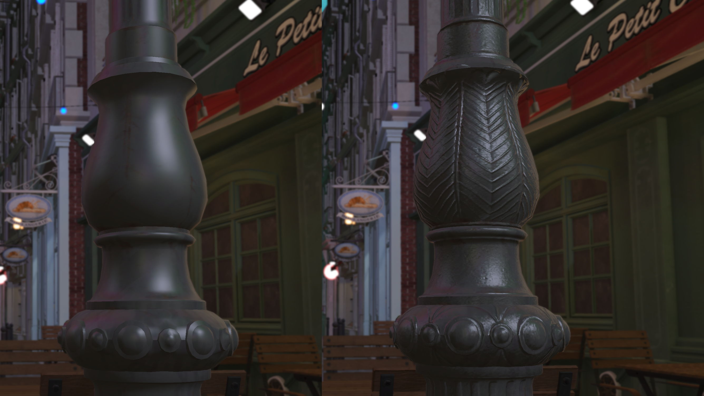
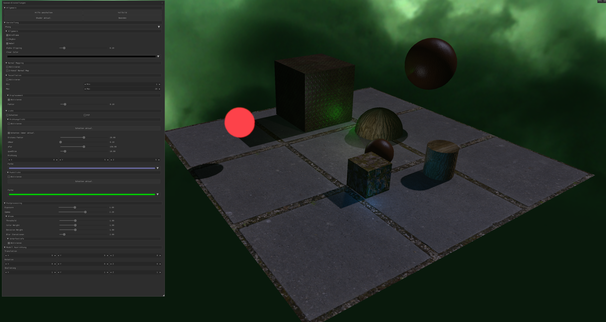

# Deferred-Rendering-Engine

A 3D engine built in C and OpenGL, featuring deferred rendering, Phong shading, normal mapping, tessellation, shadow mapping, and postprocessing effects. The engine includes camera, lighting, and scene management systems, dynamic shader reloading, and a GUI for real-time control.

This project was developed at FH Wedel as part of the **Visual Effects & Shader** module.  
All files in this repository created and edited by me can be identified by the prefix `stud` in the authors list.

## Features

- **Deferred Rendering Pipeline**
- **Phong Shading**
- **Normal Mapping (including two-channel)**
- **Tessellation & Displacement Mapping**
- **Shadow Mapping (Directional & Point Lights)**
- **Postprocessing Effects (Bloom, Gamma, Exposure, Depth of Field, Fog)**
- **Dynamic Shader Reloading**
- **Drag & Drop Scene Loading (.fbx, .json)**
- **GUI Integration (Nuklear)**

## Gallery






## Getting Started

### Prerequisites

- CMake
- OpenGL (>= 3.3)
- GLFW, cglm, assimp (included via CMake)
- Compiler supporting C99

### Build Instructions

```sh
git clone https://github.com/lufa3014/Deferred-Rendering-Engine.git
cd Deferred-Rendering-Engine
cmake -S . -B build
cmake --build build
```

### Running

After building, run the executable from the build directory:

```sh
./Deferred-Rendering-Engine
```

## Usage

- **Drag & Drop:** Load `.fbx` or `.json` scene files directly into the app window.
- **Sample Scene:** A sample `.fbx` and `.json` are provided in the release package. The `.json` includes light data for the scene.
- **GUI Controls:** Adjust rendering parameters, lighting, and postprocessing effects in real time.

## Download

A release package is available [here](https://github.com/lufa3014/Deferred-Rendering-Engine/releases/latest) containing:

- `Deferred-Rendering-Engine.exe` (Windows binary)
- `sample_scene.fbx` (Sample 3D model)
- `sample_scene.json` (Sample scene with light data)